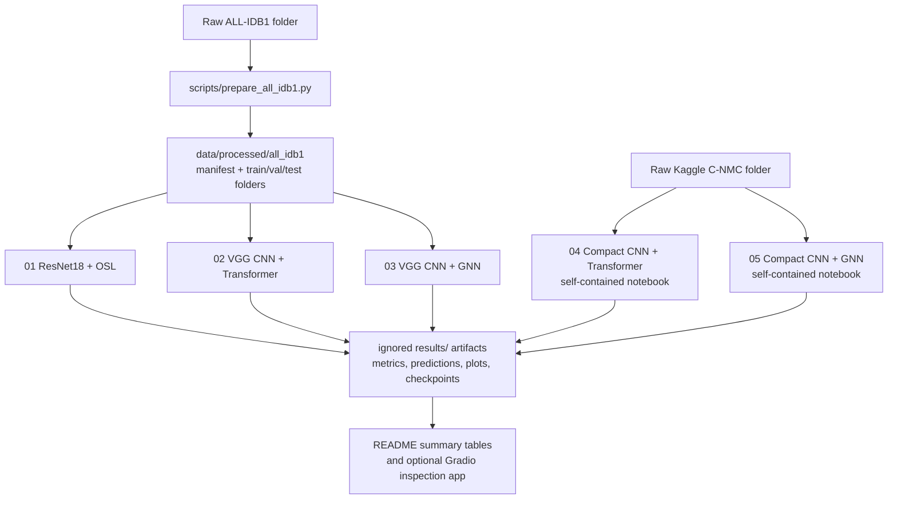
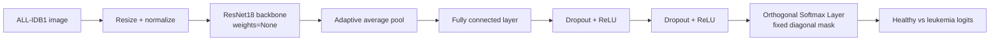
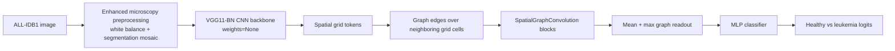

# Leukemia ML Analysis

PyTorch/Jupyter experiments for leukemia image classification on two datasets:

- **ALL-IDB1**: 108 labeled microscope images prepared from the local `ALL_IDB1` folder.
- **Kaggle C-NMC leukemia dataset**: the dataset from [andrewmvd/leukemia-classification](https://www.kaggle.com/datasets/andrewmvd/leukemia-classification), with 10,661 labeled training images and 1,867 labeled preliminary test images.

The repository is organized around five experiment notebooks. The notebooks are written to avoid unsupported claims: metrics in this README come from saved local result files, and the dataset/results/checkpoint folders are ignored by git because they are large generated artifacts.

## Repository Layout

```text
.
├── notebooks/
│   ├── 01_resnet18_osl_paper.ipynb
│   ├── 02_hybrid_cnn_transformer.ipynb
│   ├── 03_hybrid_cnn_gnn.ipynb
│   ├── 04_kaggle_cnn_transformer.ipynb
│   └── 05_kaggle_cnn_gnn.ipynb
├── src/leukemia_osl/
│   ├── model.py
│   ├── preprocess.py
│   ├── gradcam.py
│   ├── results.py
│   └── stain_features.py
├── scripts/
├── app.py
├── train.py
├── config.yaml
└── requirements.txt
```

`data/`, `results/`, `.venv/`, checkpoints, and raw model weights are intentionally not committed.

## Notebook Index

| # | Notebook | Dataset | Main architecture | Evaluation path | Main local output |
| ---: | --- | --- | --- | --- | --- |
| 1 | `01_resnet18_osl_paper.ipynb` | ALL-IDB1 | ResNet18 + Orthogonal Softmax Layer | Duplicate/content-grouped 10-fold CV | `results/resnet18_osl_paper/` |
| 2 | `02_hybrid_cnn_transformer.ipynb` | ALL-IDB1 | VGG11-BN CNN + Transformer encoder | 5 acquisition-grouped folds, plus paper-protocol comparison | `results/hybrid_cnn_transformer_vgg_grouped/` |
| 3 | `03_hybrid_cnn_gnn.ipynb` | ALL-IDB1 | VGG CNN + spatial GNN | 100-epoch grouped experiment record | `results/hybrid_cnn_gnn_vgg_enhanced_content_100ep/` |
| 4 | `04_kaggle_cnn_transformer.ipynb` | Kaggle C-NMC | Compact residual CNN + Transformer encoder | Patient-wise train/validation split and labeled preliminary-test evaluation | `results/kaggle_compact_resnet_cnn_transformer_100ep/` |
| 5 | `05_kaggle_cnn_gnn.ipynb` | Kaggle C-NMC | Compact residual CNN + spatial GNN | Patient-wise train/validation split and labeled preliminary-test evaluation | `results/kaggle_compact_resnet_cnn_gnn_100ep/` |

## Project Flow



## Setup

```bash
python3 -m venv .venv
.venv/bin/python -m pip install -r requirements.txt
```

Use the virtual environment as the VS Code/Jupyter kernel:

```text
/Users/panshulaj/Documents/AIML proj/.venv/bin/python
```

## Datasets

### ALL-IDB1

The ALL-IDB1 notebooks expect the extracted local dataset at:

```text
/Users/panshulaj/Downloads/ALL_IDB1
```

Prepare and validate it with:

```bash
.venv/bin/python scripts/prepare_all_idb1.py \
  --source /Users/panshulaj/Downloads/ALL_IDB1 \
  --processed-output data/processed/all_idb1 \
  --overwrite
```

Validation checks the official 59 healthy / 49 leukemia class count, label suffixes, duplicate content groups, and split leakage. Official ALL-IDB1 filename suffixes are interpreted as `_0` for healthy and `_1` for leukemia.

The current local prepared ImageFolder split is:

| Split | Healthy | Leukemia | Total |
| --- | ---: | ---: | ---: |
| Train | 41 | 34 | 75 |
| Validation | 8 | 7 | 15 |
| Test | 10 | 8 | 18 |
| Total | 59 | 49 | 108 |

The cross-validation notebooks do not depend only on this fixed 70/15/15 split. They also use `manifest.json` and grouped fold IDs so duplicate content or nearby acquisition bursts are kept in the same evaluation fold.

### Kaggle C-NMC leukemia dataset

The Kaggle notebooks use only the extracted Kaggle dataset folder:

```text
data/raw/kaggle_leukemia_classification/kagglehub_cache/datasets/andrewmvd/leukemia-classification/versions/2/C-NMC_Leukemia
```

The self-contained Kaggle notebooks verify these counts before training:

| Dataset area | `all` leukemia | `hem` healthy | Total |
| --- | ---: | ---: | ---: |
| Training fold 0 | 2,397 | 1,130 | 3,527 |
| Training fold 1 | 2,418 | 1,163 | 3,581 |
| Training fold 2 | 2,457 | 1,096 | 3,553 |
| Training total | 7,272 | 3,389 | 10,661 |
| Labeled preliminary test | 1,219 | 648 | 1,867 |
| Unlabeled final test folder | n/a | n/a | 2,586 |

Preliminary-test labels come from `validation_data/C-NMC_test_prelim_phase_data_labels.csv`, where label `1` maps to ALL/leukemia and label `0` maps to HEM/healthy. The unlabeled final test folder is not scored.

## Five Notebook Architecture Block Diagrams

### 01. ResNet18 + Orthogonal Softmax Layer

`notebooks/01_resnet18_osl_paper.ipynb` reproduces the paper-style ResNet18 + OSL pipeline without ImageNet pretraining.



Key details:

- Uses the literal diagonal OSL mask.
- Uses 224 x 224 RGB inputs and the `paper` preprocessing profile.
- Uses content-grouped 10-fold evaluation.
- No pretrained weights are loaded.

### 02. VGG CNN + Transformer

`notebooks/02_hybrid_cnn_transformer.ipynb` trains a VGG-style CNN feature extractor followed by a Transformer encoder on ALL-IDB1.

```mermaid
flowchart LR
    A["ALL-IDB1 image"] --> B["Microscopy preprocessing<br/>resize, normalize, stain/color augmentation"]
    B --> C["VGG11-BN CNN backbone<br/>weights=None"]
    C --> D["1x1 projection to token embedding"]
    D --> E["Flatten spatial feature map into tokens"]
    E --> F["CLS token + learned positions"]
    F --> G["Transformer encoder blocks"]
    G --> H["CLS embedding"]
    H --> I["LayerNorm + dropout + linear head"]
    I --> J["Healthy vs leukemia logits"]
```



Key details:

- Uses acquisition-grouped folds to reduce camera/session leakage.
- Uses 224 x 224 RGB inputs, a VGG11-BN backbone, 256-dim tokens, 8 attention heads, and 4 Transformer layers.
- Uses label smoothing, weight decay, gradient clipping, LR scheduling, and early stopping.
- Grad-CAM is computed on the final CNN feature map feeding the Transformer.

### 03. ALL-IDB1 CNN + GNN Record

`notebooks/03_hybrid_cnn_gnn.ipynb` records the 100-epoch CNN-GNN attempt on the same prepared ALL-IDB1 files.



Key details:

- Uses only local ALL-IDB1 images.
- Uses 224 x 224 RGB inputs, 256-dim graph tokens, 3 graph layers, and 8-neighbor grid connectivity in the saved configuration.
- Kept as a measured experiment record instead of a claimed 98% result.

### 04. Kaggle Compact ResNet CNN + Transformer

`notebooks/04_kaggle_cnn_transformer.ipynb` is self-contained. It does not import project Python modules; all dataset, model, training, evaluation, and Grad-CAM code is inside the notebook.

```mermaid
flowchart LR
    A["Kaggle C-NMC image"] --> B["Gray-world color balance"]
    B --> C["Percentile contrast stretch"]
    C --> D["Gamma correction + unsharp mask"]
    D --> E["Train-time augmentation<br/>crop, flips, rotation, affine, jitter, blur, noise, erasing"]
    E --> F["Compact residual ResNet-style CNN"]
    F --> G["1x1 projection"]
    G --> H["Spatial tokens + CLS token"]
    H --> I["Transformer encoder<br/>2 layers, 4 heads"]
    I --> J["MLP classification head"]
    J --> K["HEM vs ALL logits"]
```



Key details:

- Runs for 100 epochs by default.
- Uses 96 x 96 RGB inputs, 96-dim tokens, 2 Transformer layers, and 4 attention heads.
- Uses patient-wise train/validation split from the Kaggle training folders.
- Evaluates on the labeled preliminary test split with 4-flip TTA.
- Grad-CAM overlays are generated from the final residual CNN stage.

### 05. Kaggle Compact ResNet CNN + GNN

`notebooks/05_kaggle_cnn_gnn.ipynb` is also self-contained and uses the same Kaggle dataset checks and preprocessing.

```mermaid
flowchart LR
    A["Kaggle C-NMC image"] --> B["Gray-world + contrast + gamma + sharpening"]
    B --> C["Train-time augmentation"]
    C --> D["Compact residual ResNet-style CNN"]
    D --> E["1x1 projection to 96-dim grid tokens"]
    E --> F["12 x 12 spatial graph"]
    F --> G["8-neighbor graph message passing<br/>3 gated graph blocks"]
    G --> H["Mean + max graph pooling"]
    H --> I["MLP classification head"]
    I --> J["HEM vs ALL logits"]
```



Key details:

- Runs for 100 epochs by default.
- Uses the same Kaggle DB only.
- Uses 96 x 96 RGB inputs, 96-dim graph tokens, 3 graph layers, and an 8-neighbor 12 x 12 spatial graph.
- Uses 4-flip TTA and validation-tuned thresholding for final labeled preliminary-test evaluation.
- Grad-CAM overlays are generated from the final residual CNN feature stage before graph construction.

## Measured Results

These are the measured local outputs currently saved under ignored `results/` directories. They are summarized here for reproducibility, but the generated result folders are not committed.

### ALL-IDB1

| Notebook / model | Evaluation | Accuracy | Balanced accuracy | Macro F1 |
| --- | --- | ---: | ---: | ---: |
| `01_resnet18_osl_paper.ipynb` ResNet18 + OSL | 10 content-grouped folds | 76.85% | 74.49% | 74.14% |
| `02_hybrid_cnn_transformer.ipynb` VGG CNN + Transformer | 5 acquisition-grouped folds | 84.26% | 82.65% | 83.21% |
| `03_hybrid_cnn_gnn.ipynb` VGG CNN + GNN 100-epoch record | Content-grouped run | 93.52% | 93.38% | 93.45% |

Some earlier paper-comparable/content-grouped ALL-IDB1 runs reached much higher scores, including a 99.07% VGG CNN + Transformer run. That easier protocol is not treated as the robustness estimate because acquisition/camera metadata can leak disease labels on ALL-IDB1.

### Kaggle C-NMC

| Notebook / model | Epochs | Labeled preliminary-test accuracy | Balanced accuracy | Macro F1 | ROC-AUC | Best validation balanced accuracy | TTA validation balanced accuracy |
| --- | ---: | ---: | ---: | ---: | ---: | ---: | ---: |
| `04_kaggle_cnn_transformer.ipynb` compact ResNet CNN + Transformer | 100 | 75.42% | 66.54% | 67.49% | 83.70% | 89.90% | 92.11% |
| `05_kaggle_cnn_gnn.ipynb` compact ResNet CNN + GNN | 100 | 72.31% | 62.75% | 62.85% | 80.95% | 91.61% | 92.60% |

The Kaggle validation scores are higher than the labeled preliminary-test scores. That gap is reported as-is instead of being rounded up to the requested 98%, because the held-out preliminary split is the stronger check.

## Grad-CAM Outputs

Grad-CAM is implemented for both the shared ALL-IDB1 code path and the two self-contained Kaggle notebooks.

For the Kaggle notebooks, the latest generated contact sheets are:

```text
results/kaggle_compact_resnet_cnn_transformer_100ep/gradcam_contact_sheet.png
results/kaggle_compact_resnet_cnn_gnn_100ep/gradcam_contact_sheet.png
```

For ALL-IDB1 command-line checkpoints, heatmaps can be regenerated with:

```bash
.venv/bin/python scripts/generate_gradcam_heatmaps.py \
  --checkpoint-dir results/checkpoints/hybrid_cnn_transformer_vgg_grouped \
  --source-result-dir results/hybrid_cnn_transformer_vgg_grouped \
  --result-name gradcam_vgg_grouped_all_predicted \
  --grouping acquisition \
  --target-class predicted
```

## Gradio App

Launch the local prediction/Grad-CAM interface with:

```bash
.venv/bin/python app.py
```

The app uses the saved local checkpoints/results. Those artifacts are generated locally and ignored by git.

## Command-Line Training

Train the shared ALL-IDB1 models:

```bash
.venv/bin/python train.py --model resnet18_osl
```

```bash
.venv/bin/python train.py \
  --model hybrid_cnn_transformer \
  --cnn-backbone-name vgg11_bn \
  --preprocessing-profile hybrid \
  --report-dir results/hybrid_cnn_transformer \
  --checkpoint-dir results/checkpoints/hybrid_cnn_transformer
```

```bash
.venv/bin/python train.py \
  --model hybrid_cnn_gnn \
  --cnn-backbone-name vgg11_bn \
  --preprocessing-profile hybrid \
  --gnn-layers 3 \
  --graph-neighbors 8 \
  --report-dir results/hybrid_cnn_gnn \
  --checkpoint-dir results/checkpoints/hybrid_cnn_gnn
```

Run both shared training jobs sequentially:

```bash
.venv/bin/python scripts/train_both_models.py
```

The Kaggle models should be run from their notebooks because the user-requested versions are self-contained in one notebook per model.

## Notes On Reproducibility

- No dataset images are generated or substituted.
- No ImageNet/pretrained weights are used in the documented runs.
- Large local artifacts are intentionally ignored: `data/raw/`, `data/processed/`, `results/`, `.venv/`, `*.pt`, and `*.pth`.
- The `tsne_coordinates.csv` files in local result folders are embedding visualization coordinates only; they are not labels, bounding boxes, or a second dataset.
- The notebooks and scripts stop when expected real dataset files are missing, rather than silently training on unrelated data.
